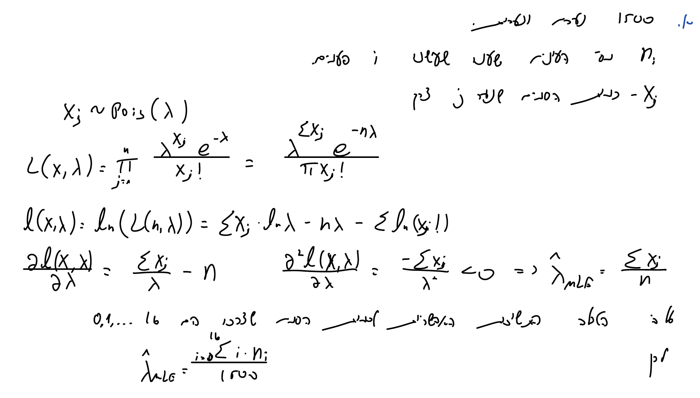
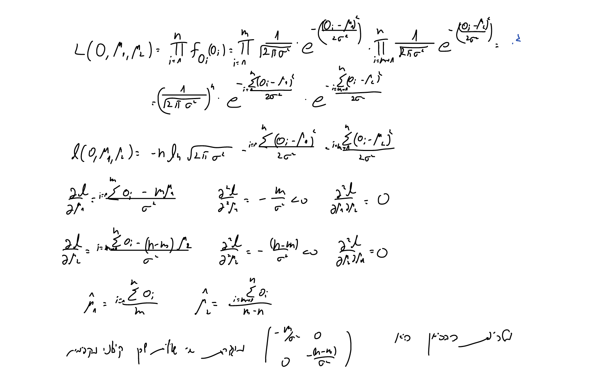

# Q1 #

## a ##


```{r}
# ex6data1 <- read.csv("C:/Users/Alon/Desktop/Studies/Statistics/Statistical_Computing/Exercises/HW6/ex6data1.csv")

ex7q1 <- read.csv("~/Desktop/Ran/D year/semester b/hishov statisti/exercies/HW7/ex7q1.csv")

```

```{r,echo=FALSE}

```

```{r}
lambda_hat.a <-  sum((ex7q1$frequencies..ni.*ex7q1$number.of.cases..i.)/1500)
cat(sprintf("lambda (MLE) = %s", lambda_hat.a) )
```

```{r}
x <- ex7q1$frequencies..ni
y <- ex7q1$number.of.cases..i.

plot(y,x,type = "o",col = "red")
y_p <- rpois(n = 1500,lambda = lambda_hat.a)
table_y_p <- as.vector(table(y_p))
y_p_unique <- sort(unique((y_p)))
lines(y_p_unique,table_y_p, type = "o",col= "blue")
```

# b #

```{r,echo=FALSE}
knitr::include_graphics(c("1.b.1.png","1.b.2.png"))
```


# c #

```{r,echo=FALSE}
knitr::include_graphics(c("1.c.1.png","1.c.2.png","1.c.3.png","1.c.4.png","1.c.5.png","1.c.6.png","1.c.7.png","1.c.8.png","1.c.9.png","1.c.10.png"))
```


```{r}
alpha_k1_numerator <- function(vec){
  lambda1.k = vec[1]
  lambda2.k = vec[2]
  alpha.k = vec[3]
  beta.k = vec[4]
  M1j.k = (alpha.k) / ((alpha.k)+(beta.k*exp(-lambda1.k))+((1-alpha.k-beta.k)*exp(-lambda2.k)))
  SUM.M1j.k = ex7q1[1,2] * M1j.k
  return(SUM.M1j.k)
}
```


```{r}
beta_k1_numerator <- function(vec){
  lambda1.k = vec[1]
  lambda2.k = vec[2]
  alpha.k = vec[3]
  beta.k = vec[4]
  M2.k = rep(NA,17)
  for (i in 1:17){
    M2.k[i] = (beta.k*(lambda1.k^ex7q1[i,1])*exp(-lambda1.k))/
    ((alpha.k*as.numeric(ex7q1[i,1]==0))+(beta.k*(lambda1.k^ex7q1[i,1])*
    exp(-lambda1.k))+((1-alpha.k-beta.k)*(lambda2.k^ex7q1[i,1])*exp(-lambda2.k)))
  }
  SUM.M2j.k = sum(ex7q1[,2]*M2.k)
  return(SUM.M2j.k)
}
```


```{r}
lambda1_k1_denominator <- function(vec){
  lambda1.k = vec[1]
  lambda2.k = vec[2]
  alpha.k = vec[3]
  beta.k = vec[4]
  M2.k = rep(NA,17)
  for (i in 1:17){
    M2.k[i] = (beta.k*(lambda1.k^ex7q1[i,1])*exp(-lambda1.k))/
    ((alpha.k*as.numeric(ex7q1[i,1]==0))+(beta.k*(lambda1.k^ex7q1[i,1])*
    exp(-lambda1.k))+((1-alpha.k-beta.k)*(lambda2.k^ex7q1[i,1])*exp(-lambda2.k)))
  }
  SUM.M2j.k = sum(ex7q1[,2]*M2.k)
  return(SUM.M2j.k)
}
```


```{r}
lambda2_k1_denominator <- function(vec){
  lambda1.k = vec[1]
  lambda2.k = vec[2]
  alpha.k = vec[3]
  beta.k = vec[4]
  M3.k = rep(NA,17)
  for (i in 1:17){
    M3.k[i] = ((1-alpha.k-beta.k)*(lambda2.k^ex7q1[i,1])*exp(-lambda2.k))/
    ((alpha.k*as.numeric(ex7q1[i,1]==0))+(beta.k*(lambda1.k^ex7q1[i,1])*
    exp(-lambda1.k))+((1-alpha.k-beta.k)*(lambda2.k^ex7q1[i,1])*exp(-lambda2.k)))
  }
  SUM.M3j.k = sum(ex7q1[,2]*M3.k)
  return(SUM.M3j.k)
}
```


```{r}
lambda1_k1_numerator <- function(vec){
  lambda1.k = vec[1]
  lambda2.k = vec[2]
  alpha.k = vec[3]
  beta.k = vec[4]
  M2.k = rep(NA,17)
  for (i in 1:17){
    M2.k[i] = (beta.k*(lambda1.k^ex7q1[i,1])*exp(-lambda1.k))/
    ((alpha.k*as.numeric(ex7q1[i,1]==0))+(beta.k*(lambda1.k^ex7q1[i,1])*
    exp(-lambda1.k))+((1-alpha.k-beta.k)*(lambda2.k^ex7q1[i,1])*exp(-lambda2.k)))
  }
  M2.k_Xj = rep(NA,17)
  for(i in 1:17){
    M2.k_Xj[i] = (ex7q1[i,1]*M2.k[i])
  }
  SUM.M2j.k_Xj = sum(ex7q1[,2]*M2.k_Xj)
  return(SUM.M2j.k_Xj)
}
```


```{r}
lambda2_k1_numerator <- function(vec){
  lambda1.k = vec[1]
  lambda2.k = vec[2]
  alpha.k = vec[3]
  beta.k = vec[4]
  M3.k = rep(NA,17)
  for (i in 1:17){
    M3.k[i] = ((1-alpha.k-beta.k)*(lambda2.k^ex7q1[i,1])*exp(-lambda2.k))/
    ((alpha.k*as.numeric(ex7q1[i,1]==0))+(beta.k*(lambda1.k^ex7q1[i,1])*
    exp(-lambda1.k))+((1-alpha.k-beta.k)*(lambda2.k^ex7q1[i,1])*exp(-lambda2.k)))
  }
  M3.k_Xj = rep(NA,17)
  for(i in 1:17){
    M3.k_Xj[i] = (ex7q1[i,1]*M3.k[i])
  }
  SUM.M3j.k_Xj = sum(ex7q1[,2]*M3.k_Xj)
  return(SUM.M3j.k_Xj)
}
```

```{r}
EM_algorithm <- function(epsilon, start){
  theta.k = start
  lambda1.kplus1 =  lambda1_k1_numerator(vec = theta.k) / lambda1_k1_denominator(vec = theta.k)
  lambda2.kplus1 =  lambda2_k1_numerator(vec = theta.k) / lambda2_k1_denominator(vec = theta.k)
  alpha.kplus1 = alpha_k1_numerator(vec = theta.k) / 1500
  beta.kplus1 = beta_k1_numerator(vec = theta.k) / 1500
  theta.kplus1 = c(lambda1.kplus1, lambda2.kplus1, alpha.kplus1, beta.kplus1)
  while(norm(theta.kplus1-theta.k, type = "2")>epsilon)
  {
    theta.k = theta.kplus1
    lambda1.kplus1 =  lambda1_k1_numerator(vec = theta.k) / lambda1_k1_denominator(vec = theta.k)
    lambda2.kplus1 =  lambda2_k1_numerator(vec = theta.k) / lambda2_k1_denominator(vec = theta.k)
    alpha.kplus1 = alpha_k1_numerator(vec = theta.k) / 1500
    beta.kplus1 = beta_k1_numerator(vec = theta.k) / 1500
    theta.kplus1 = c(lambda1.kplus1, lambda2.kplus1, alpha.kplus1, beta.kplus1)
  }
  
  return(cat(sprintf("alpha (EM) = %s", round(theta.kplus1[3],5)),
             sprintf("beta (EM) = %s", round(theta.kplus1[4],5)),
             sprintf("lambda1 (EM) = %s", round(theta.kplus1[1],5)),
             sprintf("lambda2 (EM) = %s", round(theta.kplus1[2],5)),
             sep = "\n"))
}
```


```{r}

result <- EM_algorithm(epsilon = 0.0001,start = c(6.736,11.85,1/3,1/3))
```


# Q2 #

## a ##

```{r,echo=FALSE}
knitr::include_graphics(c("2.a.1.png","2.a.2.png"))
```

```{r}
# ex6data1 <- read.csv("C:/Users/Alon/Desktop/Studies/Statistics/Statistical_Computing/Exercises/HW6/ex6data1.csv")

ex7q2 <- read.csv("~/Desktop/Ran/D year/semester b/hishov statisti/exercies/HW7/ex7q2.csv")
```


```{r}
grad_s1 <- function(mu1,sigma,o_vec,m){
  
  n <- length(o_vec)
  sum((o_vec[1:m])-mu1)/(sigma^2) - sum(dnorm(o_vec[(m+1):n],mu1,sigma)/pnorm(o_vec[(m+1):n],mu1,sigma))
}


grad_s2 <- function(mu2,sigma,o_vec,m){
  
  n <- length(o_vec)
  sum((o_vec[(m+1):n])-mu2)/(sigma^2) - sum(dnorm(o_vec[1:m],mu2,sigma)/pnorm(o_vec[1:m],mu2,sigma))
}

```


```{r}
o_vec <- ex7q2$o

m <- 7659
sigma <- 2

mu1.j <- 0
mu2.j <- 0
mu1.j_1 <- 1
mu2.j_1 <- 1
eps_for_break <- 10^-5
while(norm(matrix(c(mu1.j,mu2.j),nrow = 2)-matrix(c(mu1.j_1,mu2.j_1),nrow = 2),type = "2")>eps_for_break){
  mu1.j <- mu1.j_1
  mu2.j <- mu2.j_1
  s1 <- grad_s1(mu1.j,sigma,o_vec,m)
  s2 <- grad_s2(mu2.j,sigma,o_vec,m)
  h11 <- (grad_s1(mu1.j+0.000001,sigma,o_vec,m)-grad_s1(mu1.j-0.000001,sigma,o_vec,m))/(2*0.000001)
  h22 <- (grad_s2(mu2.j+0.000001,sigma,o_vec,m)-grad_s2(mu2.j-0.000001,sigma,o_vec,m))/(2*0.000001)
  
  H <- matrix(c(h11,0,0,h22),nrow = 2)
  mu1.j_1 <- (c(mu1.j,mu2.j) - solve(H)%*%c(s1,s2))[1]
  mu2.j_1 <- (c(mu1.j,mu2.j) - solve(H)%*%c(s1,s2))[2]
}

```

```{r,echo=FALSE}
cat(sprintf("mu1 (NR) = %s", round(mu1.j_1,5)),
    sprintf("mu2 (NR) = %s", round(mu2.j_1,5)),
    sep = "\n")
```

## b ##

```{r,echo=FALSE}
knitr::include_graphics(c("2.b.1.png","2.b.2.png"))
```

```{r}
# ex6data1 <- read.csv("C:/Users/Alon/Desktop/Studies/Statistics/Statistical_Computing/Exercises/HW6/ex6data1.csv")

ex7q2 <- read.csv("~/Desktop/Ran/D year/semester b/hishov statisti/exercies/HW7/ex7q2.csv")
```


```{r}
x_j_sum <- function(mu1_j,sigma,m,o_vec){
  n <- length(o_vec)
  sum.xj <-(sum(o_vec[1:m]) + sum((mu1_j - sigma * (dnorm( (o_vec-mu1_j) / sigma) /
                                   pnorm ( (o_vec-mu1_j) / sigma)))[(m+1):n]))
  return(sum.xj)
}

y_j_sum <- function(mu2_j,sigma,m,o_vec){
  n <- length(o_vec)
  sum.yj <-(sum((mu2_j - sigma * (dnorm( (o_vec-mu2_j) / sigma) /
                                   (pnorm ( (o_vec-mu2_j) / sigma))))[1:m]) + sum(o_vec[(m+1):n]))
  return(sum.yj)
}

```

```{r}
o_vec.Q2 <- ex7q2$o

mu1.j <- mu2.j <- mean(o_vec.Q2) # first guess

m <- 7659
sigma <- 2
n <- length(o_vec.Q2 )

eps_for_break <- 10^-5

mus_j_1 <- c(mu1.j,mu2.j)

while (TRUE) {
  mus_j <- mus_j_1
  mu1.j_1 <- x_j_sum(mus_j[1],sigma,m,o_vec.Q2) / n
  mu1.j_2 <- y_j_sum(mus_j[2],sigma,m,o_vec.Q2) / n
  mus_j_1 <- c(mu1.j_1,mu1.j_2)
  
  if (max(abs(mus_j_1 - mus_j)) < eps_for_break) {break}
}

mu1.j_1
mu1.j_2
```


```{r,echo=FALSE}
cat(sprintf("mu1 (EM) = %s", round(mu1.j_1,5)),
    sprintf("mu2 (EM) = %s", round(mu2.j_1,5)),
    sep = "\n")
```

We can see that both algorithm gave us the same result.


## c ##

```{r,echo=FALSE}

```

```{r}

mu1_mle <- sum(o_vec[1:m])/m
mu2_mle <- sum(o_vec[(m+1):10000])/(10000-m)
```

```{r,echo=FALSE}
cat(sprintf("mu1 (MLE) = %s", round(mu1_mle,5)),
    sprintf("mu2 (MLE) = %s", round(mu2_mle,5)),
    sep = "\n")
```


We see that the estimates are skewed upwards.

We know that we saw only the maximum results from the two different distribution.

Since we only see the observations with the relatively high values, it is observed that the estimators will be tilted upwards.